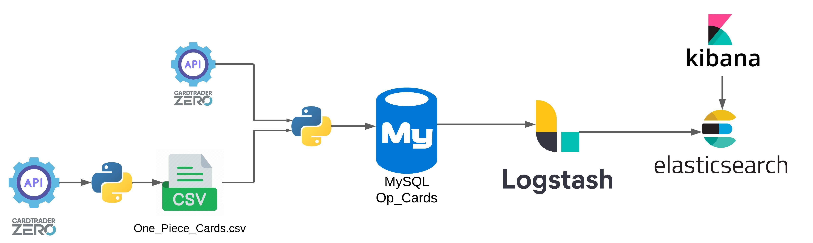

# Proyecto_CartasOP
El mercado de cartas coleccionables ha ganado popularidad en los últimos años, convirtiéndose en una industria con una alta demanda y constantes fluctuaciones de precios. Uno de los juegos más populares es One Piece Card Game.

Plataformas como CardTrader ofrecen un mercado en línea para la compra y venta de cartas sueltas. Debido a la variabilidad en los precios, contar con un sistema automatizado que monitoree estos cambios puede ser clave para facilitar la toma de decisiones en la gestión de colecciones y presupuesto.

El objetivo del proyecto es implementar un flujo de datos que permita monitorear los precios de cartas coleccionables  del juego One Piece en la tienda Cardtrader con el fin de gastar de forma eficiente aprovechando las mejores ofertas. 

Las herramientas que se usan son:
- Docker
- MySQL
- Logstash
- Elasticsearch
- Kibana

